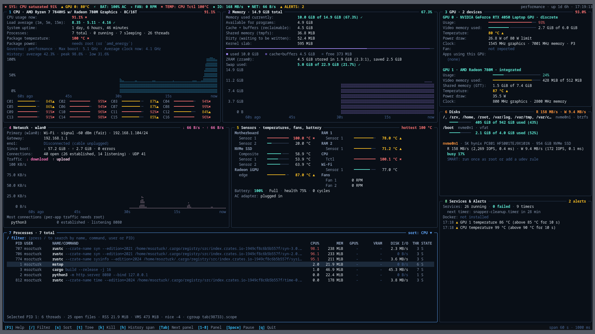

# mstop

[](https://github.com/msozturktr/mstop/actions/workflows/ci.yml)

**mstop** is a terminal system monitor for Linux. It labels every value in plain language with explicit units, gives every graph a scale and a time axis, and marks status with symbols as well as colour. Compared to tools like btop or htop, it brings in more data sources (multiple GPUs, sensors and battery, SMART, systemd, containers, a 24-hour history) while keeping its own overhead around 2% of a single core.



## Features

### CPU (panel 1)
- Total and per-core usage, per-core clock, governor, max boost
- Load average, uptime, process and thread counts
- Package temperature and package power (RAPL)
- Usage history graph

### Memory (panel 2)
- Used / available, cache + buffers, shared, dirty, slab, swap
- ZRAM compression ratio and savings
- Stacked usage bar and history graph

### GPU (panel 3)
- NVIDIA (NVML, loaded at runtime, with an `nvidia-smi` fallback) and AMD (amdgpu sysfs)
- Multiple GPUs on hybrid laptops
- Utilization, VRAM, GTT, temperature, power draw vs. limit, clocks, fan, P-state
- Apps using each GPU, with per-process GPU % and VRAM (DRM fdinfo)
- Never wakes a suspended discrete GPU, and backs off polling while it is idle so it can autosuspend

### Network (panel 4)
- Per-interface rates, totals since boot, errors and drops, link state and speed
- Wi-Fi signal strength with a plain-language quality rating
- IPv4/IPv6 addresses and default gateway
- TCP/UDP socket counts by state
- Apps with the most connections (per-app traffic would require root/eBPF)

### Sensors (panel 5)
- All hwmon chips, grouped under friendly names
- Temperatures with severity bars, fan speeds
- Battery: charge, rate in watts, time left, health, cycle count; AC state and ACPI platform profile
- CPU temperature history

### Disks (panel 6)
- Per-disk read/write throughput, IOPS, average latency, busy %, model
- Mounts with used and free space (btrfs subvolumes grouped per device)
- SMART health, temperature, power-on hours and wear via `smartctl`, refreshed every 10 minutes without waking drives in standby

### Processes (panel 7)
- Sortable table: CPU, memory, PID, name, disk I/O
- Tree view and filtering by name, command, user or PID
- Columns: PID, user, command, CPU %, memory, GPU %, VRAM, disk I/O, threads, state
- Detail line for the selected process: threads, open files, RSS, VMS, nice, cgroup
- Kill with confirmation (SIGTERM or SIGKILL); the process identity is re-checked before signalling, so a reused PID is never hit

### Services & Alerts (panel 8)
- systemd system and user units: running and failed counts, failed units with exit status and time
- Timers, with the next one due
- Docker / Podman containers via their sockets: state, CPU and memory from cgroup v2
- Alert log: temperatures, memory and swap pressure, disk fullness, SMART failures, newly failed units, low battery, interfaces going up or down, runaway processes. Alerts use hysteresis and minimum durations so they do not flap.

### Interface
- Header line of status chips: system state, GPU temperature, battery, fans, power profile, hottest sensor, SMART, disk fullness, I/O, network, failed services, active alerts
- Adaptive layout: three columns at 200+ columns, two at 120–199, stacked below; works down to 80×24
- History: per-minute averages for 24 hours, saved to `$XDG_STATE_HOME/mstop/history` (default `~/.local/state/mstop/history`) every 5 minutes and on exit
- `h` switches every graph between 60 s, 10 min, 1 h and 24 h spans

## Requirements

- Linux
- Rust 1.88 or newer (edition 2024) to build
- Optional: NVIDIA driver (NVML or `nvidia-smi`), `smartctl` (smartmontools), Docker or Podman

## Installation

```sh
git clone https://github.com/msozturktr/mstop.git
cd mstop
cargo install --path .
```

This installs `mstop` into `~/.cargo/bin`. To build without installing, run `cargo build --release`; the binary is `target/release/mstop`.

## Usage

```text
mstop [OPTIONS]

Options:
  --interval <ms>   Refresh interval in milliseconds (default: 1000)
  --dump            Collect two samples, print every value as plain text, and exit
  --help            Print help
```

## Key bindings

| Key | Action |
|---|---|
| `q`, `Ctrl-C` | Quit |
| `F1`, `?` | Toggle help |
| `Up` `Down` `PgUp` `PgDn` `Home` `End` | Move the process selection |
| `/` | Filter processes (`Enter` keeps the filter, `Esc` clears it) |
| `s` / `S` | Cycle sort key / reverse sort direction |
| `t` | Toggle process tree |
| `k` | Kill the selected process: `y` SIGTERM, `K` SIGKILL, `n` cancel |
| `h` | Cycle graph history span |
| `Space` | Pause / resume updates |
| `Tab`, `Shift-Tab` | Next / previous panel |
| `1`–`8` | Focus CPU, Memory, GPU, Network, Sensors, Disks, Processes, Services |
| `Esc` | Close dialogs |

## Permissions

mstop runs as a normal user. A few data sources need more access; without it the panel shows a short hint instead of an error.

| Data | Needs | Without it |
|---|---|---|
| CPU package power | Read access to `/sys/class/powercap/intel-rapl:0/energy_uj` | Hint in the CPU panel |
| SMART | Root for `smartctl` | Hint in the Disks panel |
| Per-app connections | Read access to other users' `/proc/<pid>/fd` | Only your own processes are counted |
| Containers | Access to the Docker or Podman socket (e.g. the `docker` group) | Hint in the Services panel |

## Data sources

| Panel | Sources |
|---|---|
| CPU | `/proc/stat`, `/sys/devices/system/cpu/*/cpufreq`, powercap RAPL |
| Memory | `/proc/meminfo`, `/sys/block/zram*` |
| GPU | `/sys/class/drm`, NVML / `nvidia-smi`, `/proc/<pid>/fdinfo` |
| Network | `/proc/net/dev`, `/proc/net/{tcp,tcp6,udp,udp6,route,wireless}`, `/sys/class/net`, `getifaddrs` |
| Sensors | `/sys/class/hwmon`, `/sys/class/power_supply`, `/sys/firmware/acpi/platform_profile` |
| Disks | `/proc/diskstats`, `/proc/self/mountinfo`, `statvfs`, `smartctl` |
| Processes | `/proc/<pid>` |
| Services | `systemctl` (system and user managers), Docker / Podman API sockets, cgroup v2 |

## Development

```sh
cargo test
cargo clippy --all-targets -- -D warnings
cargo fmt --check
```

`MSTOP_PRINT=1 cargo test renders_large -- --nocapture` prints the full layout rendered from synthetic data, which is handy when working on the UI.

## License

[MIT](LICENSE)
